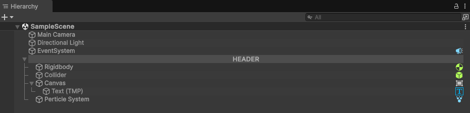
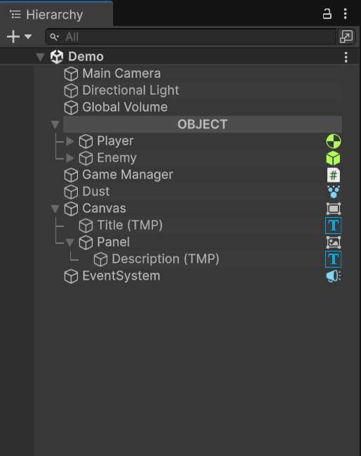
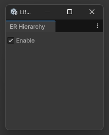

<h1 align="left">ER Hierarchy</h1>

###

The Hierarchy Editor is a custom tool designed to enhance the visual organization and management of GameObjects within Unity’s Hierarchy window. This tool provides a more intuitive and visually appealing interface that simplifies how developers interact with and structure objects in a scene. By adding visual cues such as gradient highlights, connector lines, and component icons, the Hierarchy Editor helps streamline the development workflow and improve clarity when working on complex scenes.

Don’t forget to enable this tool from the Menu Bar.

###

<h2 align="left">Features</h2>

###

  <li><strong>Gradient Highlight for Each Object</strong> Every GameObject in the Hierarchy is given a soft gradient highlight, making it easier to distinguish between objects and improving overall readability.</li> 
  li><strong>Connector Lines Between Parent and Child Objects</strong> Visual lines are drawn between parent and child GameObjects, clearly representing the hierarchy structure. This makes nested relationships more immediately visible and easier to follow./li> 
  <li><strong>Component Icons Displayed Next to GameObject Names</strong> If a GameObject has certain components (e.g., Rigidbody, Collider, Light), an appropriate icon is displayed beside the object’s name. This feature helps developers quickly identify the components attached to each object without needing to inspect them manually. </li>
  <li><strong>Header Object Styling Using '---' Text Users can turn any GameObject into a visual section header by including the text "---" in its name. This will apply a distinct styling to the object, visually separating it from other items and helping organize the hierarchy into clearly defined sections.

<ul align="left">
  <li><strong>Title</strong> Adds a text heading above a variable, useful for grouping or highlighting sections in the Inspector.</li> 
  <li><strong>Info Box</strong> Displays an information box containing explanations or notes related to a serialized variable, helpful for documentation or usage guidance.</li> 
  <li><strong>Show If</strong> Conditionally displays a variable in the Inspector only if a specific boolean value is true. This helps keep the Inspector clean and only shows relevant data when needed.</li> 
  <li><strong>Read Only</strong> Makes a variable viewable but not editable in the Inspector. Ideal for displaying runtime data or values that shouldn't be modified manually.</li> 
  <li><strong>Asset Only</strong> Restricts variable assignment to assets only (e.g., prefabs, sprites, materials). It prevents scene objects from being assigned to the variable.</li> 
  <li><strong>Scene Only</strong> Opposite of Asset Only, this limits variable references to scene objects (Hierarchy), disallowing asset assignments.</li> 
  <li><strong>Button</strong> Enables calling a method directly from the Inspector using a button, great for debugging or executing editor-side functions quickly.</li>
</ul>

###

<h2 align="left">Highlight</h2>

###

  

  

  

###
