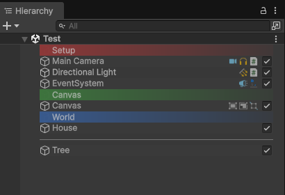

# ER Hierarchy

**ER Hierarchy** is a Unity Editor extension that enhances Unity's built in **Hierarchy** window, adding row coloring, component icons, an active toggle, parent child connector lines, plus colored headers and separators for organizing GameObjects.



## Features

- **Alternating Row Colors**: Rows in the hierarchy are colored alternately for easier readability.
- **Component Icons**: Shows icons of the scripts/components attached to each GameObject on the right side of the hierarchy.
- **Active Toggle**: A checkbox to enable or disable a GameObject directly from the hierarchy without opening the Inspector.
- **Hierarchy Tree Lines**: Vertical and horizontal lines connecting parent and child objects, making the hierarchy structure easier to follow. Lines are highlighted when an ancestor is selected.
- **ER Header**: A component for adding a gradient colored header used as a separator or label for a group of objects in the hierarchy. Available color presets: `Gray`, `Red`, `Green`, `Blue`, `Yellow`, and `Custom`.
- **ER Separator**: A component for adding a simple divider line between groups of objects in the hierarchy.

## Installation

1. Copy the `Scripts` folder into the `Assets` folder of your Unity project (or import it as a `.unitypackage` if you distribute it that way).
2. Make sure the following structure is included:

```
   Scripts/
   ├── Editor/
   │   ├── ERHierarchyEditor.cs
   │   └── ERHierarchyToggleEditor.cs
   ├── ERHeader.cs
   └── ERSeparator.cs
```

3. Wait for Unity to finish compiling. No additional setup is required.

## Usage

### Enabling / Disabling ER Hierarchy

Open the menu `Tools > ER Hierarchy > Enable` or `Tools > ER Hierarchy > Disable`.

The enabled state is saved automatically and persists across Editor sessions using `PlayerPrefs`, so it does not need to be turned on again every time the project is opened.

### Adding a Header

Right click a GameObject in the hierarchy (or use the `GameObject` menu), then select `GameObject > ER Hierarchy > Add Header` and choose a color (`Gray`, `Red`, `Green`, `Blue`, or `Yellow`).

The header color can be changed afterward in the Inspector on the `ER Header` component, including a `Custom` option for a free color choice.

### Adding a Separator

Select `GameObject > ER Hierarchy > Add Separator`.

This adds an `ER Separator` component that displays a divider line on that GameObject's row in the hierarchy.

## Requirements

- Unity Editor (all features run inside `#if UNITY_EDITOR`, so they have no effect on runtime builds).
- No external dependencies.

## Project Structure

| File | Description |
|---|---|
| `Scripts/Editor/ERHierarchyEditor.cs` | Core logic: alternating rows, component icons, active toggle, and tree lines. |
| `Scripts/Editor/ERHierarchyToggleEditor.cs` | Menu items to enable/disable ER Hierarchy along with preference storage. |
| `Scripts/ERHeader.cs` | Colored header component plus the context menu to add it. |
| `Scripts/ERSeparator.cs` | Separator component plus the context menu to add it. |

## License

Add your project's license information here (for example MIT, Unity Asset Store EULA, etc).
